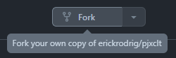

# Contribuição - Desenvolvimento

Obrigado por querer botar a mão na massa! Esse é um guia rápido de como você pode implementar suas soluções.

## Stack

Esse projetinho está utilizando a seguinte stack:

Core:
- [React](https://react.dev/)
- [Typescript](https://www.typescriptlang.org/)

Estilização
- [Chakra UI](https://chakra-ui.com/)
- [Tailwind CSS](https://tailwindcss.com/)
- [Chart.js](https://www.chartjs.org/)

Testes
- [Jest](https://jestjs.io/)

Hosting:
- [Cloudflare Pages](https://pages.cloudflare.com)

## Build & deploy

O projeto mira na simplicidade e não segue à risca nenhum padrão de indústria. Como a hospedagem está sendo feita no Cloudflare Pages, cada PR mergeada na branch principal, é automáticamente gerado um build & deploy diretamente pro site [pjxclt.com](https://pjxclt.com), simplificando o processo de atualização e manutenção sem se preocupar com releases, já que se trata de algo simples. 

## Desenvolvendo

1. Faça um fork do repositório:

  <p align="center">
    
  </p>

2.  Clone o seu repositório: 

    ```bash
    git clone git@github.com:<seu nome de usuario>/pjxclt
    cd pjxclt
    ```

3. Adicione o repo original como upstream para manter seu fork sincronizado: 

    ```bash
    git remote add upstream git@github.com:erickrodrig/pjxclt
    ```

4. Instale as dependências:

    ```bash
    npm install
    ```

5. Crie sua branch: 

    ```bash
    git checkout -b <sua branch>
    ```

6. Execute o programa localmente: 

    ```bash
    npm start
    ```

7. Codifique suas alterações.

8. Verifique se é necessário incluir novos testes, e então rode:

    ```bash
    npm test
    ```

## Abrindo uma pull request

Após ter finalizado, testado e enviado suas alterações para seu repositório remoto, [crie uma pull request](https://github.com/erickrodrig/pjxclt/pulls) apontando para o repositório principal explicando brevemente as alterações feitas e como as mudanças agregam ao projeto.
